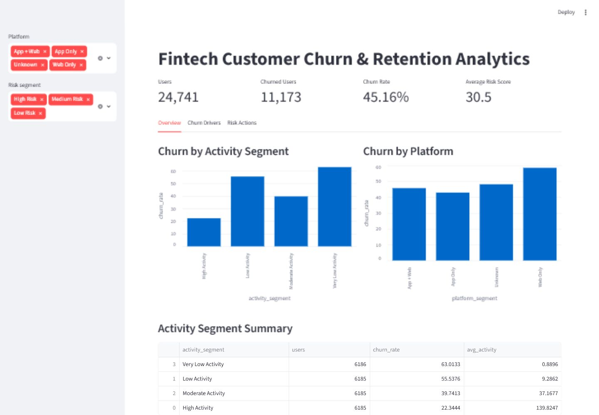
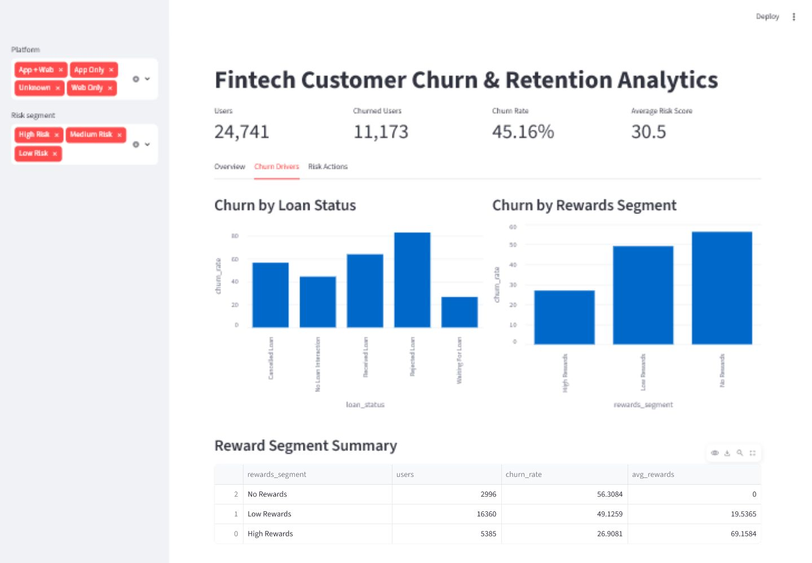
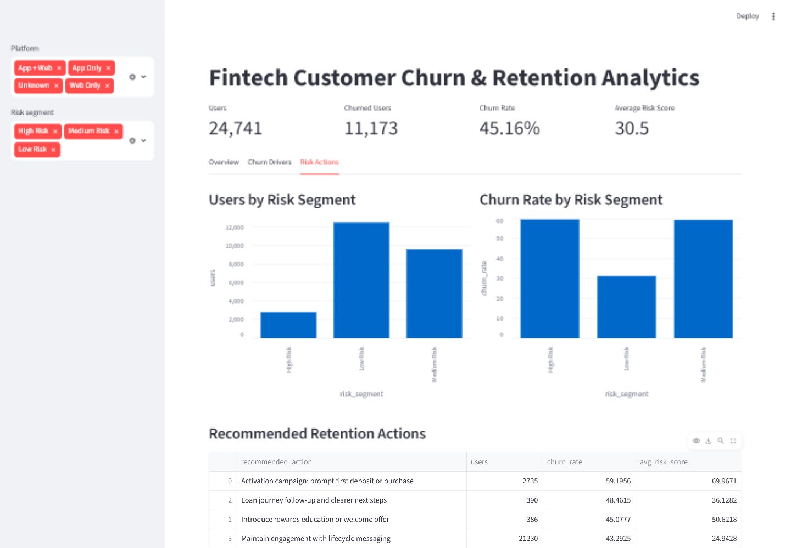

# Fintech Customer Churn & Retention Analytics

## Project Overview

This portfolio project analyzes customer churn for a fintech product using Python, SQL, SQLite, and Streamlit.

The goal is to understand which customer behaviors are linked to churn, identify high-risk user segments, and recommend practical retention actions for the business.

## Business Questions

- What is the overall user-level churn rate?
- How does churn differ between low-activity and high-activity users?
- Which loan journey outcomes are linked with higher churn?
- Do referred users churn less than non-referred users?
- How do rewards relate to churn?
- Which platform segments have the highest churn?
- Which users should the business prioritize for retention?
- What actions should the business take for each churn-risk segment?

## Dataset

The project uses a public fintech churn dataset from Kaggle.

The raw file contains 27,000 rows and 24,741 unique users. Because some users appear more than once, the analysis is performed at a user level. A user is marked as churned if any of their records indicate churn.

## Project Structure

```text
fintech-churn-analysis/
  dashboard/
    app.py
  outputs/
    users_enriched.csv
    01_churn_overview.csv
    ...
    10_recommended_actions.csv
  scripts/
    eda_01.py
    build_user_table.py
    export_results.py
  sql/
    01_churn_overview.sql
    ...
    10_recommended_actions.sql
  screenshots/
    dashboard_overview.png
    churn_drivers.png
    risk_actions.png
  README.md
  requirements.txt
```

## Tools Used

- Python
- Pandas
- SQL
- SQLite
- Streamlit
- Matplotlib

## Key Findings

- The user-level churn rate is approximately 45%.
- Very low activity users have the highest churn rate.
- Users with rejected or cancelled loan journeys show elevated churn risk.
- Referred users churn less than non-referred users.
- Users with high rewards have materially lower churn.
- Web-only users churn more than app users.

## Dashboard Preview

### Overview


### Churn Drivers


### Risk Actions


## How to Run

Install dependencies:

```bash
pip install -r requirements.txt
```

Build the user-level table and output files:

```bash
python scripts/build_user_table.py
python scripts/export_results.py
```

Run the dashboard:

```bash
streamlit run dashboard/app.py
```

## Business Recommendations

- Improve activation for very low activity users by encouraging a first deposit, first purchase, or first partner purchase.
- Add follow-up communication for rejected or cancelled loan journeys.
- Use rewards education or welcome offers for users with no rewards.
- Encourage web-only users to download and use the mobile app.
- Prioritize high-risk users using the churn risk segment and recommended action table.

## Portfolio Summary

This project demonstrates how a data analyst can clean raw fintech data, transform it into a user-level table, use SQL to answer business questions, build churn-risk segments, and communicate insights through an interactive dashboard.
